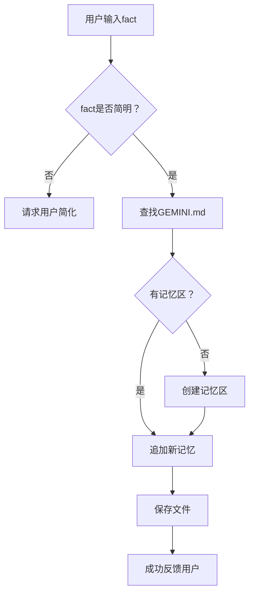

## 🧠 **序章：记忆的艺术，机器的魔法**

在漫长的人类历史中，记忆是一种珍贵的财富。古希腊诗人靠冗长的诗句记住英雄的故事，现代人则用云端和硬盘锁住自己的点滴。而在人工智能的世界，记忆的力量同样不可小觑——尤其是当一个AI助手能像贴心朋友那样，牢牢记住你喜欢菠萝披萨还是猫咪的名字时，这种“长生不忘”的能力仿佛为冷冰冰的机器注入一丝温情。

今天，我们要探访的主角是 Google Gemini 的“记忆工具”，它如何优雅地将一条条用户小秘密悄悄植入自己的“长久记忆”，成为一位值得信赖的智能魔法师？

---

## 📝 **定义记忆：一条事实的旅程**

在 Gemini 的世界里，记忆不是无边无际的“脑海”，而是一条条清晰、精准的小径。每当用户说出“记住我喜欢蓝色”或“请帮我保存：我家猫叫Whiskers”，一条叫作 `fact` 的信息就启程了。这个“fact”必须短小精悍，像闪电一样抓住要点，不能啰嗦、不能含糊——只有这样，Gemini 才会郑重地把它收进自己的记忆殿堂。

> **注解**  
> “fact” 就是“事实”，在这里指用户想让AI长期记住的简明信息，比如“我的生日是5月4日”，而不是一大段聊天内容。

---

## 🗂️ **记忆存储：从“GEMINI.md”到长久陪伴**

Gemini 的记忆，并不是随风而逝的耳语，而被郑重地写进了一本叫做 `GEMINI.md` 的数字日记。这本日记藏在你电脑家目录下的 `.gemini` 文件夹里，任何被选中的“fact”都会被写入专门的“记忆区”——`## Gemini Added Memories`。每一个记忆点都被小心翼翼地列成 Markdown 的列表，像极了书架上一行行珍藏的书籍。

**记忆区的样例结构：**

```markdown
## Gemini Added Memories
- 我喜欢菠萝披萨
- 我的猫叫Whiskers
```

> **注解**  
> Markdown 是一种轻量级标记语言，像写微信“笔记”一样简单。“-” 表示列表项，所以每条记忆都是一行列表。

---

## 🔑 **记忆的钥匙：存储流程揭秘**

那么，一条信息如何变成Gemini的长久记忆呢？整个过程就像一场细致的仪式——

1. **信息提取**：首先，工具会检查这条“fact”是否简明扼要、值得记住。如果你说得模棱两可或者太啰嗦，Gemini 会礼貌地拒绝：“你确定要我记住这个吗？”
2. **文件定位**：找到 `.gemini/GEMINI.md` 文件，没有就自动创建。
3. **记忆区查找**：如果文件中没有“## Gemini Added Memories”这一章节，就自动添加，有的话就在该区追加新记忆。
4. **格式保证**：每条新记忆都要去掉多余的“-”和空格，避免把记忆弄成混乱的“列表嵌套”。
5. **保存成功反馈**：最后，Gemini 会温柔地回复你：“好的，我记住了：‘我的猫叫Whiskers’”。

> **注解**  
> 这种机制不仅让AI记忆有条不紊，还能防止重复或杂乱的信息污染整个“记忆区”。

---

## 🗃️ **多文件同步：记忆的分身术**

除了主文件 `GEMINI.md`，Gemini 还能灵活地接受多个文件作为记忆容器——就像一个人有几本日记本。通过 `setGeminiMdFilename` 方法，用户可以随时切换、指定不同的记忆文件，让AI的记忆像分身一样，适应不同的场景和需求。

> **注解**  
> 这就像你有一本“工作日记”和一本“生活日记”，AI可以按需切换存储和调用。

---

## 🕵️ **记忆的守门人：什么不能记？**

一个合格的记忆管家，懂得筛选什么需要永久保存，什么只是过眼云烟。Gemini 的记忆工具严守三条底线：

- 不记“只对当前会话有用”的碎片信息。
- 不保存冗长、复杂或胡言乱语的内容。
- 如果不确定是不是要记，AI会主动追问：“需要我记住这个吗？”

这种“守门人”机制让AI的记忆既不过载，也不遗漏重要细节。

---

## 🛠️ **记忆的工程学：底层实现一览**

在幕后，Gemini 的“MemoryTool” 继承自 `BaseTool`，专门负责“保存记忆”这一功能。其核心方法 `performAddMemoryEntry`，遵循如下工作流：

1. **文本修剪**：去掉开头多余的“-”或空格，保证格式统一。
2. **文件操作**：通过异步的文件系统API（如 `fs.readFile`、`fs.writeFile`、`fs.mkdir`），安全地读取、写入和创建目录。
3. **章节定位**：智能定位“记忆区”，确保新记忆不会插错地方。
4. **容错处理**：如果写入出错，AI会详细记录报错信息，并向用户汇报。

这一切，都让AI的记忆如钟表般精确可靠。

---

## 🔄 **记忆的更新与维护：不止于存储**

Gemini 不只是“写入型”记忆机器。每次添加新记忆时，都会检查已有内容，防止重复和冲突。并且，工具还保证每次写入都不会破坏原有结构——新旧记忆如同和谐共处的邻居，各据一席之地。

> **注解**  
> 如果一个记忆点已经存在，AI可以提醒你“这条我已经记住啦”，有效防止“记忆叠加”导致混乱。

---

## 📋 **实用案例：AI贴心助理的日常**

让我们来看看真实世界中的应用场景：

- **用户A**： “记住，我喜欢黑咖啡。”  
  _AI回复：_ “好的，我记住了：‘我喜欢黑咖啡’。”
- **用户B**：“我家狗叫Lucky，请帮我记录。”  
  _AI回复：_ “好的，我记住了：‘我家狗叫Lucky’。”
- **用户C**：“帮我保存这段话：今天心情不错，所以决定早睡早起，保持健康。”  
  _AI回复：_ “很抱歉，这段内容太长了，需要简化后我才能记住哦！”

---

## 🧩 **结构示意图：Gemini 的记忆流程**



---

## 📑 **代码片段赏析：精妙的实现细节**

```typescript
if (!fact || typeof fact !== 'string' || fact.trim() === '') {
  // 错误处理：fact必须为非空字符串
}

await MemoryTool.performAddMemoryEntry(fact, getGlobalMemoryFilePath(), {
  readFile: fs.readFile,
  writeFile: fs.writeFile,
  mkdir: fs.mkdir,
});
```

> **注解**  
> 代码中多处细节处理——如自动建目录、格式化内容、异常捕获——都反映出工程师对“记忆可靠性”的极致追求。

---

## 🌱 **未来展望：AI记忆的成长与进化**

今天的 Gemini 记忆工具，为AI赋予了“长久记忆”的能力，让它能像老朋友一样记住你的偏好和小秘密。未来，AI的记忆会更灵活智能——比如自动归类、优先级排序、甚至根据你的需求自动“遗忘”某些信息。也许有一天，AI会主动提醒你：“上次你说要早睡，今天也要早点休息哦！”

---

## 📚 **参考文献**

1. google-gemini/gemini-cli 源码，`memoryTool.ts` 文件（2025）
2. Markdown 语法官方文档
3. Node.js `fs/promises` 文件系统API文档
4. “人类记忆机制与人工智能”综述论文，Science Advances (2022)
5. “智能助手用户体验设计”，ACM CHI (2024)

---

> **友情提示**  
> AI的记忆，也需要你的善意指引——简明、重要的事实，才能被记得长久。下次让AI记住什么时，不妨试着像写一条推特一样精炼吧！

